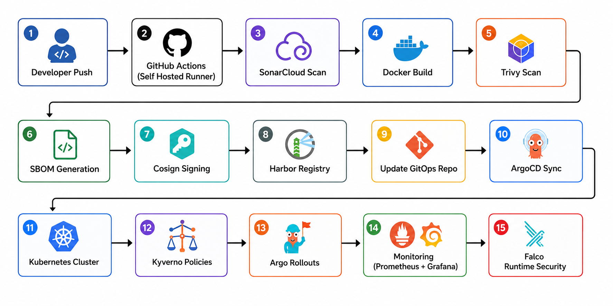

# Enterprise DevSecOps GitOps Platform on Kubernetes


Enterprise-grade DevSecOps platform built on Kubernetes using GitOps, policy-as-code, supply chain security, progressive delivery, observability, and runtime threat detection.

---

# Platform Overview

This project demonstrates a production-style Kubernetes DevSecOps platform running on a multi-node kubeadm cluster provisioned with Vagrant.

The platform follows GitOps principles using ArgoCD and integrates multiple security layers across the software delivery lifecycle including:

- Supply chain security
- Policy enforcement
- Runtime security
- Progressive delivery
- Secret management
- Observability
- Automated GitOps deployment

---

# Architecture Diagram



---

# Key Features

## GitOps Deployment
- ArgoCD-based GitOps workflow
- Multi-environment deployment strategy
- Automated sync and reconciliation
- Declarative Kubernetes infrastructure

## Kubernetes Security
- Kyverno policy enforcement
- Image signature verification
- Resource validation policies
- Non-root enforcement
- Privileged container blocking
- Latest tag prevention
- HostPath restriction policies

## Runtime Security
- Falco runtime threat detection
- Kubernetes audit monitoring
- Container activity monitoring

## Supply Chain Security
- Trivy vulnerability scanning
- SBOM generation
- Cosign image signing
- Harbor registry integration
- Signed container image verification

## Progressive Delivery
- Argo Rollouts canary deployments
- Controlled rollout strategy
- Automated rollback support

## Secrets Management
- External Secrets Operator integration
- Vault-based secret management
- Centralized secret storage

## Observability Stack
- Prometheus monitoring
- Grafana dashboards
- Kyverno metrics integration
- Kubernetes cluster monitoring

---

# Technology Stack

| Category | Tools |
|---|---|
| Container Orchestration | Kubernetes (kubeadm) |
| GitOps | ArgoCD |
| Progressive Delivery | Argo Rollouts |
| Policy Enforcement | Kyverno |
| Runtime Security | Falco |
| Secrets Management | Vault + External Secrets Operator |
| Monitoring | Prometheus + Grafana |
| Container Registry | Harbor |
| CI/CD | GitHub Actions |
| Security Scanning | Trivy |
| Image Signing | Cosign |
| Code Quality | SonarCloud |
| Infrastructure | Vagrant + VirtualBox |

---

# Repository Structure

```bash
.
├── assets
│   ├── architecture.png
│   ├── demo-01.gif
│   └── demo-02.gif
├── bootstrap
│   ├── infra-root.yaml
│   └── platform-app.yaml
├── infra
│   ├── applications
│   │   ├── kustomization.yaml
│   │   ├── kyverno-policies-app
│   │   │   ├── application.yaml
│   │   │   └── kustomization.yaml
│   │   ├── network-policies-app
│   │   ├── rbac-app
│   │   │   ├── application.yaml
│   │   │   └── kustomization.yaml
│   │   └── vault-app
│   │       ├── application.yaml
│   │       └── kustomization.yaml
│   ├── kustomization.yaml
│   ├── manifests
│   │   ├── kyverno-policies
│   │   │   ├── base
│   │   │   │   ├── clusterpolicy
│   │   │   │   │   ├── allowed-registries.yaml
│   │   │   │   │   ├── disallow-hostpath.yaml
│   │   │   │   │   ├── disallow-latest-tag.yaml
│   │   │   │   │   ├── disallow-privileged-containers.yaml
│   │   │   │   │   ├── disallow-privilege-escalation.yaml
│   │   │   │   │   ├── kustomization.yaml
│   │   │   │   │   ├── require-non-root.yaml
│   │   │   │   │   ├── require-probes.yaml
│   │   │   │   │   ├── require-resources.yaml
│   │   │   │   │   └── verify-keyless-signatures.yaml
│   │   │   │   └── kustomization.yaml
│   │   │   ├── kustomization.yaml
│   │   │   └── patch.yaml
│   │   ├── network-policies
│   │   ├── rbac
│   │   │   ├── base
│   │   │   │   ├── external-secrets-rbac.yaml
│   │   │   │   ├── falco-rbac.yaml
│   │   │   │   ├── kustomization.yaml
│   │   │   │   ├── kyverno-rbac.yaml
│   │   │   │   └── monitoring-rbac.yaml
│   │   │   └── kustomization.yaml
│   │   └── vault
│   │       ├── base
│   │       │   ├── cluster-role-binding.yaml
│   │       │   ├── cluster-sa.yaml
│   │       │   ├── clustersecretstore.yaml
│   │       │   ├── cluster-token.yaml
│   │       │   ├── kustomization.yaml
│   │       │   ├── secret-crb.yaml
│   │       │   ├── secret-sa.yaml
│   │       │   ├── secretstore-dev.yaml
│   │       │   └── secret-token.yaml
│   │       └── kustomization.yaml
│   └── projects
│       ├── k8s-infra-project.yaml
│       └── kustomization.yaml
├── platform
│   ├── applications
│   │   ├── argo-rollouts
│   │   │   └── application.yaml
│   │   ├── cert-manager
│   │   │   └── application.yaml
│   │   ├── external-secrets
│   │   │   └── application.yaml
│   │   ├── falco
│   │   │   └── application.yaml
│   │   ├── ingress-nginx
│   │   │   └── application.yaml
│   │   ├── kustomization.yaml
│   │   ├── kyverno
│   │   │   └── application.yaml
│   │   ├── metrics-server
│   │   │   └── application.yaml
│   │   └── monitoring
│   │       └── application.yaml
│   ├── kustomization.yaml
│   └── projects
│       ├── k8s-observability.yaml
│       ├── k8s-platform.yaml
│       ├── k8s-security.yaml
│       └── kustomization.yaml
└── README.md
```

---

# Platform Components

## Platform Services

| Component | Purpose |
|---|---|
| ArgoCD | GitOps continuous delivery |
| Kyverno | Kubernetes policy engine |
| Falco | Runtime threat detection |
| Harbor | Secure image registry |
| External Secrets Operator | Secret synchronization |
| Vault | Centralized secret management |
| Argo Rollouts | Progressive delivery |
| Metrics Server | Kubernetes resource metrics |
| Prometheus | Metrics collection |
| Grafana | Visualization dashboards |

---

# Security Policies

The platform enforces multiple Kyverno security policies including:

- Allowed container registries
- Require resource requests and limits
- Require liveness/readiness probes
- Prevent privileged containers
- Prevent privilege escalation
- Require non-root containers
- Block latest image tags
- Block hostPath volumes
- Verify signed container images

---

# Kyverno Policy Demo


---

## ArgoCD GitOps Dashboard


---

# Monitoring Stack

Grafana dashboards integrated with Prometheus and Kyverno metrics.


---

# Deployment Environment

## Kubernetes Cluster
- kubeadm-based Kubernetes cluster
- Multi-node environment
- Hosted locally using Vagrant and VirtualBox

## CI/CD Environment
- GitHub Actions
- Self-hosted runners

---

# Related Repositories

## Application Source Repository
https://github.com/Ajaz3800/devsecops-app

## GitOps Deployment Repository
https://github.com/Ajaz3800/devsecops-gitops

---

# Future Improvements

- Falco alert forwarding integration
- Slack/Discord alerting
- Service mesh integration
- Multi-cluster GitOps management
- OPA Gatekeeper comparison
- Advanced SLO monitoring
- Automated incident response

---

# Learning Outcomes

This project helped strengthen practical knowledge in:

- Kubernetes Administration
- DevSecOps
- GitOps Workflows
- Policy-as-Code
- Supply Chain Security
- Runtime Security
- CI/CD Automation
- Kubernetes Observability
- Progressive Delivery

---


## ⭐ Support

If you find this project helpful, please give it a star ⭐ on GitHub.

---

## 🌐 Connect With Me

<div align="center">
  
[](https://www.linkedin.com/in/shaikh-muhammad-ajaz)
[](mailto:shaikhajaz38000@gmail.com)
[](https://www.youtube.com/@devopswithajaz)
</div>

<div align="center">

[](https://upwork.com/freelancers/muhammadajaz)
[](https://www.fiverr.com/ajazshaikh3800)
</div>

---

<div align="center">
  
### 💡 "Turning ideas into production-ready systems."


[](https://github.com/Ajaz3800)

</div>